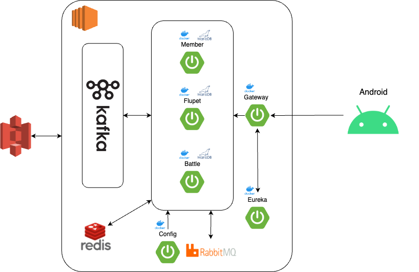
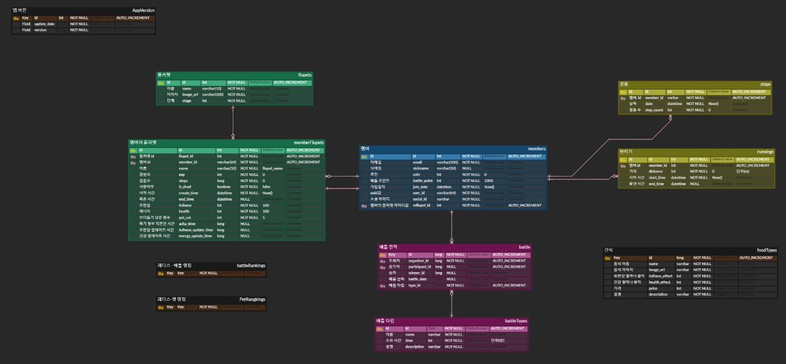

# Fluffit (플러핏)

### 꾸준한 운동을 통해 성장하는 캐릭터 

## 🎥 소개 영상

- 
## 배경

사람들에게 건강은 항상 최우선으로 거론될 정도로 아주 중요합니다. 하지만 바쁜 일상 속에서 건강 관리를 위해 꾸준히 노력하는 것은 쉽지 않고, 금방 포기하는 경우가 많습니다
- 한국 성인의 3분의 1이 운동 부족으로 인해 건강 위험에 처해 있음
- 운동은 건강에 필수적이지만, 반복적이고 지루한 활동으로 인해 지속하기 어려움

이러한 문제를 게임이란 도구를 이용하여 해결하고 건강 관리에 대한 흥미와 참여도를 높이기 위해 갤럭시 워치의 헬스케어 기능과 키릭터 키우기를 결합한 서비스를 기획했습니다.

## 개발기간

|           |     [프로젝트 일정]     |
| :-------: | :---------------------: |
| 진행 기간 | 2024.04.08 - 2024.05.19 |
|   인원    |           6명           |

## 팀원 역할 분배
|   **Name**   |                정원준                 |                이준서                |                  최지수                   |               정수현                |                 이창곤                  |               여창영                |
| :----------: | :-----------------------------------: | :----------------------------------: | :---------------------------------------: | :---------------------------------: | :-------------------------------------: | :---------------------------------: |
| **Position** |          Backend           |          Backend           |           Backend          |        Frontend         |            Frontend            |         Frontend          |

## 주요 기술

**Backend**

- java17
- springboot 3.2.5
- spring jpa
- spring gateway
- spring eureka
- spring config
- spring web
- oauth2
- intelliJ IDE
- QueryDSL
- rabitMQ
- kafka

**Frontend**

**DataBase**
- mariaDB
- Redis

**Infra**
- aws ec2
- docker & docker compose
- jenkins

## 협업 툴
- git
- notion
- jira
- mattermost

# git 컨벤션

### **커밋 타입**

- **feat**: 새로운 기능 추가
- **fix**: 버그 수정
- **docs**: 문서 변경사항
- **style**: 코드 포맷 변경, 세미콜론 누락 등 코드의 기능에 영향을 주지 않는 변경사항
- **refactor**: 코드 리팩토링
- **test**: 테스트 코드, 리팩토링 테스트 코드 추가
- **chore**: 빌드 업무 수정, 패키지 매니저 설정 등의 변경사항

### **제목**

- 50자를 넘지 않도록 합니다.
- 명령문 형태로 작성합니다.
- 대문자로 시작합니다.
- 마지막에 마침표(.)를 사용하지 않습니다.

### **본문 (선택적)**

- 적절히 줄바꿈을 합니다.
- 어떻게보다는 무엇을, 왜 변경했는지를 설명합니다.

## architecture

## ERD

## 주요 서비스 화면 

